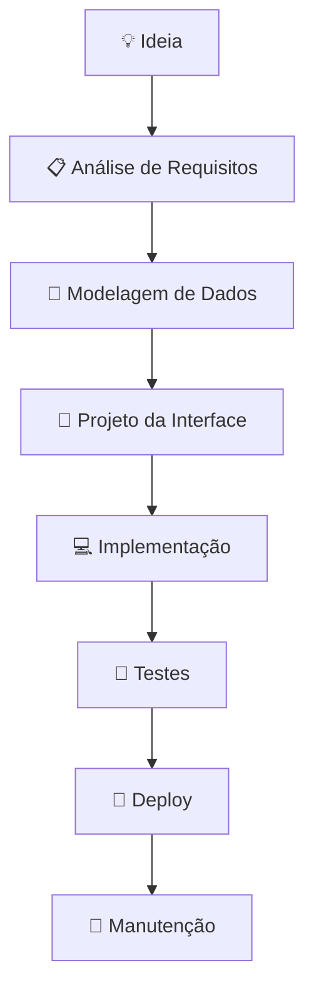

# 📎 Exemplo

> *Última atualização: 2025-07-24*

Este é um exemplo de como criar uma página dentro da wiki.
Você pode usá-lo como modelo para organizar suas anotações, com títulos, seções, listas e links internos.

## 🧮 Matemática

$$
\frac{A}{B} = \frac{C}{X} \Rightarrow X = \frac{B \cdot C}{A}
$$

## 📊 Fluxograma



## 👋 Hello World

```cpp
#include <iostream>

int main() {
    std::cout << "Hello, world!" << std::endl;
    return 0;
}
```
