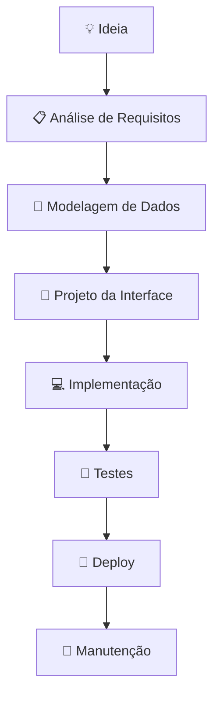

# 📎 Exemplo

> *Última atualização: 2025-07-24*

Este é um exemplo de como criar uma página dentro da wiki.
Você pode usá-lo como modelo para organizar suas anotações, com títulos, seções, listas e links internos.

## 📚 Índice

- [📐 Cálculo](#️📐-cálculo)
  - [🧮 Regra de Três](#🧮-regra-de-três)
- [🗂️ Ícones](#️🗂️-ícones)
  - [📘 Documentação](#📘-documentação)
  - [💻 Tecnologia](#💻-documentação)
  - [🔍 Organização](#🔍-organização)
  - [🧠 Estudo](#🧠-estudo)
  - [🚀 Projetos](#🚀-projetos)
  - [💬 Comunicação](#💬-comunicação)
  - [🧪 Exemplos](#🧪-exemplos)
- [📊 Fluxograma](#📊-fluxograma)
- [👋 Hello World](#👋-hello-world)

## [📐 Cálculo](#📚-índice)

### [🧮 Regra de Três](#📚-índice)

$$
\frac{A}{B} = \frac{C}{X} \Rightarrow X = \frac{B \cdot C}{A}
$$

## [🗂️ Ícones](#📚-índice)

### [📘 Documentação](#📚-índice)

📄 📑 📝 📚 📒 🧾 📓 📕 📔 📎 📌

### [💻 Tecnologia](#📚-índice)
💻 🧠 🧮 🔧 🛠️ 🧰 🖥️ ⌨️ 🧱 🧑‍💻 🧵

### [🔍 Organização](#📚-índice)
📁 🗂️ 📂 🗃️ 🗄️ 📌 📎 🧭 🔖 🧷 🔗

### [🧠 Estudo](#📚-índice)
🧠 📚 📖 🧑‍🏫 🧪 🎓 📊 📈 🗒️ 🧾

### [🚀 Projetos](#📚-índice)
🚀 ⚙️ 📦 🧪 🔬 🧱 🧰 📈 📌 📍

### [💬 Comunicação](#📚-índice)
💬 📢 📣 ⚠️ ❗ ❕ 🔔 🛎️

### [🧪 Exemplos](#📚-índice)
📄 🧾 📝 🧪 🧬 🧫

## [📊 Fluxograma](#📚-índice)


```mermaid
graph TD
  A[💡 Ideia]
  B[📋 Análise de Requisitos]
  C[🧩 Modelagem de Dados]
  D[🎨 Projeto da Interface]
  E[💻 Implementação]
  F[🧪 Testes]
  G[🚀 Deploy]
  H[🔧 Manutenção]

  A --> B
  B --> C
  C --> D
  D --> E
  E --> F
  F --> G
  G --> H
```

## [👋 Hello World](#📚-índice)

```cpp
#include <iostream>

int main() {
    std::cout << "Hello, world!" << std::endl;
    return 0;
}
```
